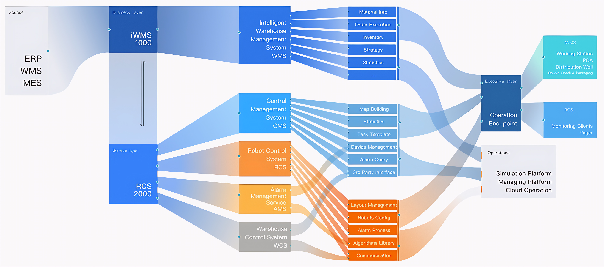

# 🤖 Robotics and Automation in RMG Manufacturing (FLAP Project)

**Crystal International Group Ltd. | Amigo Bangladesh Ltd.**  
*Industry 4.0 Implementation in Ready-Made Garments (RMG) Manufacturing*

  
  
  
  
  

---

## 🧠 Overview
The **FLAP Project** (Factory Logistics Automation Platform) is a flagship **Industry 4.0 initiative** developed by **Crystal International Group Ltd.**, one of the world’s leading **Ready-Made Garments (RMG)** manufacturers.  
It integrates **robotics**, **industrial automation**, and **digital manufacturing systems** into a unified, intelligent production ecosystem.

After successful implementation in China, FLAP demonstrated:
- 🚀 **40% higher production efficiency**
- ⚙️ Reduced manual labor & human error
- 🔄 Seamless process-to-process information and material flow
- 📈 Enhanced data visibility and production traceability

**Amigo Bangladesh Ltd.**, a subsidiary of Crystal Group, is the first Bangladeshi facility to implement this **end-to-end automation system**, marking a significant step toward **smart manufacturing transformation** in the textile sector.

---

## 👨‍🔧 Author & Role
**Md. Asraful Hasan Apu**  
*Senior Robotics & Automation Engineer*  
Crystal International Group Ltd.  

**Responsibilities:**
- Developed intelligent **AGV/AMR systems** for automated material transport using **AI-driven navigation** and **dynamic path planning**.
- Integrated **robotic arms, elevators, and conveyors** with AGVs for full material-handling automation.
- Established **MES–RCS communication** for process synchronization and job execution.
- Designed **PLC/HMI-based subsystems** for localized automation and system feedback.
- Managed **cross-functional team collaboration**, user training, and project timelines.
- Oversaw **budget and performance optimization** for robotic and automation deployments.

---

## 🏗️ System Architecture

  

### 🔹 Layered Architecture

The FLAP architecture is based on a **multi-layer control hierarchy**, ensuring seamless communication between enterprise-level systems and field-level robotic devices.

Enterprise Layer
├── CICS (Central Information & Control System)
│ ├── MES (Manufacturing Execution System)
│ ├── WMS (Warehouse Management System)
│ └── RCS (Robotic Control System)
│
└── Field Layer
├── AGV / AMR Robots
├── Robotic Arms
├── Elevators, Conveyors
└── PLC/HMI Systems

**Key Figures:**
- `CICS_Information_Flow.png` — Information hierarchy  
- `Overall_Process_Flow.PNG` — Material and data flow  
- `System_Process_Flow.png` — Process logic and control relationship  

---

## ⚙️ Process Flow Breakdown

### 🟦 1. Operation Center
Centralized dashboard for system supervision, robot tracking, and data visualization.  
Interfaces include:
- `Operation_Center_Main_Interface.PNG`
- `Operation_Center_Second_Interface.PNG`

### 🟩 2. Cutting & Spreading Zone
Automated cutting and fabric spreading linked directly to CICS for task execution.  
- `Cutting_Task_Allocation_as_per_CICS.jpg`  
- `Spreading_Process_User_Interface.jpg`  
- `Spreading_Operator_Working.jpg`

### 🟨 3. Relaxation Zone
Automated relaxation process with WIP tracking and operator interface.  
- `Relaxation_Process_Flow.PNG`  
- `Relax_WIP_Monitoring.jpg`  
- `Relax_Operator_Working.jpg`

### 🟥 4. Inspection Zone
AI-driven defect detection and quality inspection via smart vision systems.  
- `Inspection_WorkStaton.jpg`  
- `Inspection_Worker_Operationg.jpg`

### 🟧 5. AGV / AMR Transportation
Fleet of AGV/AMR robots managing real-time logistics between workstations.  
- Charging Stations: `AGV_Charging_Station_2.jpg`, `AGV_Charging_Station_3.jpg`, `AGV_Charing_Station.jpg`
- Material Queue Zone: `Empty_Trolley_Zone.jpg`

---

## 🔗 System Integration Summary

| Layer | System | Function |
|-------|---------|----------|
| **Enterprise** | CICS | Central command and data management |
| **Control** | RCS | Task scheduling, path planning, AGV management |
| **Execution** | MES | Job allocation, order tracking, production feedback |
| **Field** | HIKRobot Platform | Hardware and sensor integration |
| **Human Interface** | Operation Center | Visualization, analytics, control override |

Each system communicates over **TCP/IP and OPC-UA**, enabling **real-time synchronization** between physical robots and digital systems.

---

## 🤖 Robotics and Automation Components

| Component | Description |
|------------|-------------|
| **AGV/AMR Robots** | Smart mobile robots for intra-factory material logistics |
| **RCS (Robotic Control System)** | Real-time AGV fleet management and route optimization |
| **PLC/HMI Systems** | Embedded automation for process equipment |
| **Vision Systems** | AI-based inspection and quality control |
| **HIKRobot Framework** | Localization, camera tracking, and motion feedback |
| **CICS Dashboard** | Global system supervision and analytics |

---

## 📊 Project Outcomes

✅ **40% increase in production throughput**  
✅ **Full traceability** from fabric input to cutting and inspection  
✅ **Zero manual intervention** in inter-process material movement  
✅ **First full FLAP deployment in Bangladesh**  
✅ **Scalable integration model** for future expansion (ASRS, cobots, etc.)

---

## 🔬 Research & Innovation Insights

This project represents a real-world **Industry 4.0 implementation case study** with academic relevance in:
- Multi-robot task allocation and path planning  
- Cyber-physical MES–RCS–AGV coordination  
- Adaptive scheduling for dynamic manufacturing  
- Vision-guided inspection and AI-enabled logistics  

### 🧩 Future Research Directions
- Reinforcement Learning for AGV decision-making  
- Digital Twin simulation for predictive analytics  
- Collaborative human–robot interaction in RMG workflow  

---

## 🖼️ Demonstrations

| Category | Example Images |
|-----------|----------------|
| **System Monitoring** | `RCS_Main_Interface.PNG`, `RCS_Statics_Interface.PNG` |
| **Process Flow** | `System_Process_Flow.png`, `Overall_Process_Flow.PNG` |
| **Automation Zones** | `Spreading_User_Interface.jpg`, `Inspection_WorkStaton.jpg` |
| **AGV Operations** | `AGV_Charging_Station_2.jpg`, `AGV_Charging_Station_3.jpg` |

---

## 🚀 Future Expansion
- Integration of **ASRS (Automated Storage & Retrieval System)**  
- Implementation of **robotic manipulators** for material loading/unloading  
- Deployment of **predictive maintenance AI** modules  
- **Cloud synchronization** across regional factories  

---

## 📚 Citation

If you reference this work in research or presentations, please cite as:

Hasan, M. A. (2025). Robotics and Automation in RMG Manufacturing (FLAP Project).
Crystal International Group Ltd., Amigo Bangladesh Ltd.

---

## 📞 Contact
**Md. Asraful Hasan Apu**  
Senior Robotics & Automation Engineer  
Crystal International Group Ltd. | Amigo Bangladesh Ltd.  
📍 Bangladesh  
📧 [Email](mailto:example@email.com) | 🔗 [LinkedIn](#) | 💻 [GitHub](#)

---

  © 2025 Crystal International Group Ltd. — All Rights Reserved  

