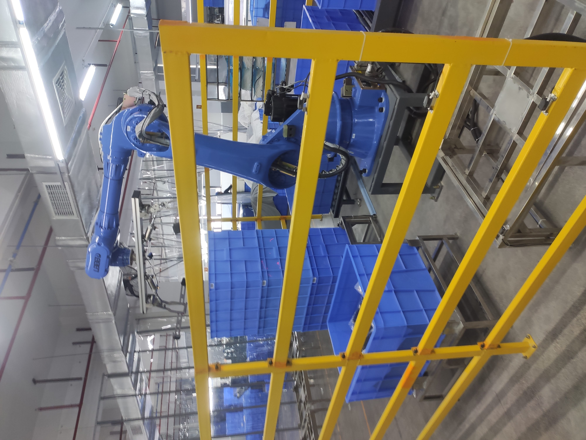

#  FLAP–Autonomous Mobile Robot Driven Cyber-Physical Smart Manufacturing System in RMG Industry

**Crystal International Group Ltd. | Amigo Bangladesh Ltd.**  
*Industry 4.0 Implementation in Ready-Made Garments (RMG) Manufacturing*

<p align="center">
  
  
  
  
  
</p>

---

## 🧠 Overview

The **FLAP Project** (Finishing Center, Logistic Center, Assembly Center, Parts Center) is a flagship **Industry 4.0 initiative** by **Crystal International Group Ltd.**, one of the world’s leading **Ready-Made Garments (RMG)** manufacturers.  
It integrates **robotics**, **industrial automation**, and **digital manufacturing systems** into a unified, intelligent production ecosystem.

After successful implementation in China, FLAP demonstrated:

- 🚀 **40% higher production efficiency**
- ⚙️ Reduced manual labor and human error
- 🔄 Seamless process-to-process information and material flow
- 📈 Enhanced data visibility and traceability

**Amigo Bangladesh Ltd.**, a subsidiary of Crystal Group, is the first facility in Bangladesh to implement this system, representing a major leap toward **smart manufacturing transformation** in the textile industry.

---

## 👨‍🔧 Author & Role

**Md. Asraful Hasan Apu**  
*Senior Robotics & Automation Engineer*  
Crystal International Group Ltd.  

**Responsibilities:**

- Developed intelligent **AGV/AMR systems** for automated material transport using **AI-driven navigation** and **dynamic path planning**.  
- Integrated **robotic arms, elevators, and conveyors** with AGVs for complete material-handling automation.  
- Established **MES–RCS communication** for synchronized process execution.  
- Designed and deployed **PLC/HMI-based subsystems** integrated into the central control framework.  
- Led **cross-functional coordination**, user training, and on-site deployment.  
- Managed **budget and performance optimization** for robotic and automation rollouts.

---

## 🏗️ System Architecture

<p align="center">
  
</p>

### 🔹 Multilayer Control Architecture

The FLAP architecture follows a **hierarchical control model**, ensuring seamless data and command flow between enterprise-level decision systems and field-level robotic equipment.

```
Enterprise Layer
 ├── CICS (Crystal Integrated Cutting System)
 ├── MES (Manufacturing Execution System)
 ├── WMS (Warehouse Management System)
 └── RCS (Robotic Control System)
 
Field Layer
 ├── AGV / AMR Robots (Navigation, local control)
 ├── Robotic Arms (Pick/place, loading)
 ├── PLC/HMI Systems (Local machine control)
 └── Vision Systems (Inspection / QC)

Physical Infrastructure
 ├── Charging Stations
 ├── Conveyors & Elevators
 └── Workstations (Cutting, Spreading, Relaxation, Inspection)
```

**Reference Figures:**
<p align="center">
  
</p>

---

## ⚙️ Process Flow Breakdown

### 🟦 Overall Process Flow
Overall flow of process how material and informations transferred processwise. 
<p align="center">
    
</p>

### 🟨 Relaxation
Automated relaxation process ensuring consistent fabric handling before cutting.  
<p align="center">
    
    
</p>


### 🟩 Cutting & Spreading
Automated fabric spreading and cutting managed by the CICS system.  
<p align="center">
  
    
</p>


### 🟥 Inspection Zone
Fbric Inspection process has been automated by AGV transportation and User interface based working procedure 
<p align="center">
  
    
</p>

## ⚙️ Autonomous Mobile Robots

### 🟦 AGV (Automated Guided Vehicle) System Configurtion
AGV System configuration by RCS (Robotic Control System) and Fleet Management
<p align="center"style=align-items: center;">
  
    
</p>


### 🟧 AGV Operation
Autonomous robots perform inter-process material transport and staging.  
<p align="center">
  
    
</p>

---

## 🔗 System Integration Summary

| Layer | System | Function |
|-------|---------|----------|
| **Enterprise** | CICS | Centralized data and command management |
| **Control** | RCS | AGV task execution and path planning |
| **Execution** | MES | Scheduling and production tracking |
| **Field** | HIKRobot Platform | Hardware integration and sensor data |
| **Human Interface** | Operation Center | Real-time analytics and supervision |

All systems communicate through **TCP/IP** and **OPC-UA**, enabling full interoperability between digital control and robotic execution layers.

---

## 🤖 Robotics and Automation Components

| Component | Description |
|------------|-------------|
| **AGV / AMR Robots** | Autonomous mobile platforms for fabric and WIP transport |
| **RCS (Robotic Control System)** | Multi-robot coordination and navigation control |
| **PLC / HMI Systems** | Local automation for conveyors and mechanical stations |
| **Vision Systems** | AI-based fabric inspection and quality detection |
| **HIKRobot Framework** | Provides vision tracking, sensor data, and localization |
| **CICS Dashboard** | Unified monitoring and analytics across all subsystems |

---

## 📊 Project Outcomes

✅ **40% increase in production throughput**  
✅ **End-to-end digital traceability** of materials  
✅ **Zero manual intervention** in logistics between processes  
✅ **First full FLAP deployment in Bangladesh**  
✅ **Modular design** for scalable Industry 4.0 integration  

---

## 🔬 Research & Innovation Insights

This project demonstrates a **real-world Industry 4.0 architecture** with strong research implications in:

- Multi-robot task allocation and optimization  
- Cyber-physical MES–RCS–AGV integration  
- Vision-based inspection and quality control  
- Intelligent scheduling and dynamic path planning  


---

<p align="center">
  © 2025 Md Asraful Hasan Apu — All Rights Reserved  
</p>
